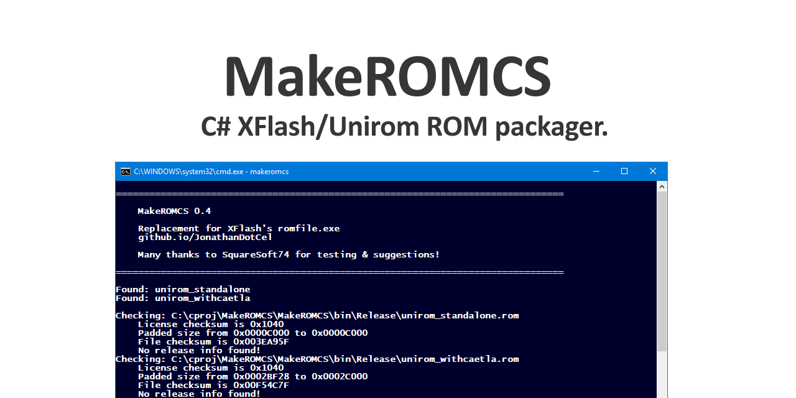

# MakeROMCS
Feb 2020 - github.com/JonathanDotCel

- Packages ROMs into a single .DAT for use on the Unirom 8 bootdisc.
- New option to sort by filename/internal name
- Option to chose filename for > Unirom 8.0.b1
- Backwards compatible with XFlash

# GPL BEER LICENSE.
It's the same as the GPL3, but if you fork it, you must send me a beer and leave the original headers.
As an addition, only add credits; never remove.

